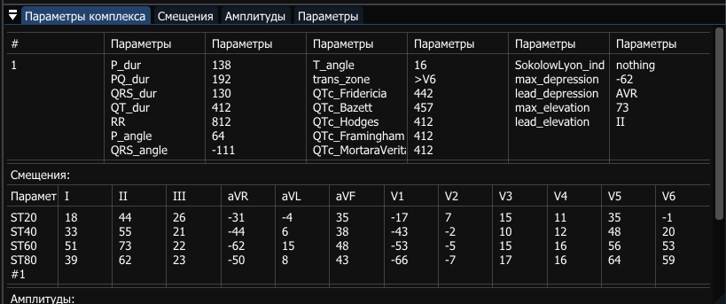
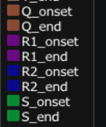

# Настройка
1. Необходимо установить путь до директории, содрежащей сигналы.
Для этого потребутеся измеить константное значение пременной PATH в модуле *src/httpRequests.jl*:

``` julia
const PATH = "path/to/your/directory"
```
2. При необходимости можно изменить *USER, PORT, HOST* в модуле *src/httpRequests.jl*:
``` julia
const USER = "Your username"
const PORT = "Your port"
const HOST = "Your host"
```
Начальные настройки:
``` julia
const USER = "tmp"
const PORT = "8089"
const HOST = "0.0.0.0"
```
3. Там же можно изменить начальные настройки филтрации:
``` julia
const FILTERS = "Your filters"
```
Начальные настройки:
``` julia
const FILTERS = "isoline,50Hz"
```

# "Особенности"
1. При нажатии на любой пукт в данном меню укзатель вернется на индекс представительного комплекса и станут отображаться его параметры.


2. Расшифровка цветов ChannelBounds.

